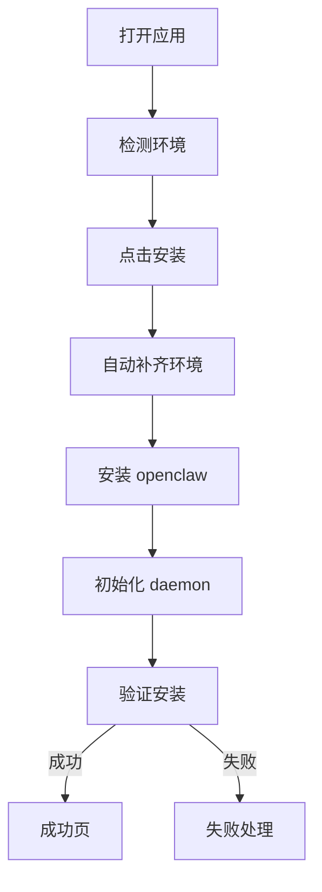
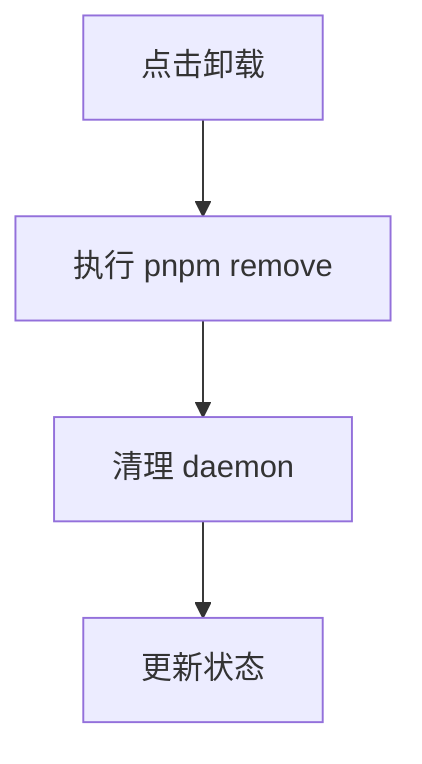
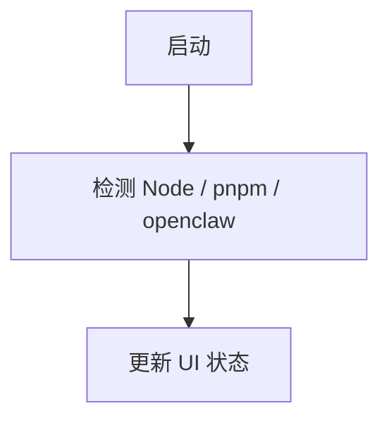

# 🦞 小龙虾一键安装器 PRD（产品级完整版）

（基于原始文档重构与强化，适用于设计 / 开发 / 测试直接落地）
参考原始版本：

---

# 1. TL;DR

小龙虾一键安装器是一个面向非技术用户的 OpenClaw 图形化安装工具，通过封装复杂 CLI 安装流程，实现：

* 用户仅需 **1 次点击完成安装**
* 全流程无需命令行
* 自动补齐环境（Node / pnpm / registry）
* 安装失败可自动修复

### 核心成功指标

* 安装成功率 ≥ 95%
* 平均安装时长 ≤ 3 分钟
* 用户操作次数 ≤ 1 次
* 自动修复成功率 ≥ 70%

---

# 2. 问题陈述

OpenClaw 当前安装流程依赖 CLI：

```bash
pnpm add -g openclaw@latest
openclaw onboard --install-daemon
```

对非技术用户存在系统性障碍：

* 不理解 Node.js / npm / pnpm
* 无法处理环境缺失
* 无法理解错误信息
* 无法自行修复安装失败

### 本质问题

> 用户不是不会操作，而是“无法完成安装闭环”。

### 产品要解决的核心

**将不可控安装过程 → 转化为可控结果**

---

# 3. 产品目标

## 3.1 用户目标

* 不使用命令行完成安装
* 不理解技术细节仍可成功
* 出错时有明确解决路径

---

## 3.2 商业目标

* 提升 OpenClaw 安装转化率
* 降低安装阶段流失
* 成为默认分发入口

---

## 3.3 非目标

* 不替代 CLI 高级能力
* 不支持复杂配置
* 不处理 OpenClaw runtime 问题

---

# 4. 用户分层

## 4.1 小白用户（核心）

* 不理解任何技术概念
* 只接受“一键成功”

👉 默认体验模式

---

## 4.2 进阶用户

* 关注安装过程
* 能理解部分错误

👉 可展开详情

---

## 4.3 开发者

* 需要日志与调试能力

👉 高级模式

---

# 5. 产品定位

> 本产品是“环境编排器”，不是安装包工具。

负责：

* 环境检测
* 依赖安装
* CLI安装
* 初始化
* 卸载

不负责：

* OpenClaw功能本身
* 游戏资源管理

---

# 6. 核心体验原则

1. 用户只做一件事：点击安装
2. 所有复杂性默认隐藏
3. 出错必须可恢复
4. 反馈必须可理解

---

# 7. 核心用户流程

## 7.1 安装流程



---

## 7.2 卸载流程



---

## 7.3 启动检测流程



---

# 8. 核心功能设计

## 8.1 环境检测

* Node.js 检测（版本 ≥ 22）
* npm 检测
* pnpm 检测
* openclaw 检测
* registry 检测

---

## 8.2 自动环境补齐

### Node.js

* 自动下载官方安装包
* 自动执行安装器
* 安装后重新检测

---

### pnpm

```bash
npm install -g pnpm
```

---

### registry

自动设置：

```
https://registry.npmmirror.com
```

---

## 8.3 OpenClaw 安装

```bash
pnpm add -g openclaw@latest
```

---

## 8.4 初始化

```bash
openclaw onboard --install-daemon
```

---

## 8.5 安装验证

* 检测 CLI 可执行
* 标记安装成功

---

## 8.6 卸载能力

```bash
pnpm remove -g openclaw
```

扩展：

* daemon 清理
* 残留检测

---

# 9. 自动修复系统（关键能力）

## 9.1 自动修复策略

失败后自动执行：

1. 重试安装（最多2次）
2. 切换 registry
3. 检查权限问题
4. 重启关键步骤

---

## 9.2 错误分类

| 类型   | 示例      |
| ---- | ------- |
| 网络错误 | 下载失败    |
| 权限错误 | EACCES  |
| 环境错误 | Node缺失  |
| 命令错误 | CLI执行失败 |

---

## 9.3 错误转译

| 原始错误         | 用户提示   |
| ------------ | ------ |
| EACCES       | 权限不足   |
| ECONNREFUSED | 网络连接异常 |

---

## 9.4 用户恢复路径

* 一键重试
* 查看详情
* 复制日志

---

# 10. UI/UX设计

## 10.1 首页

* 当前状态（已安装 / 未安装）
* 主按钮：立即安装
* 简短说明

---

## 10.2 安装中

展示：

* 当前阶段（抽象）
* 进度条

不展示：

* 技术细节

---

## 10.3 成功页

* 安装完成提示
* 启动入口
* 教程入口

---

## 10.4 失败页

* 问题说明（人类语言）
* 自动修复说明
* 操作按钮（重试 / 日志）

---

## 10.5 高级模式

* 展示执行命令
* 展示日志
* 展示环境信息

---

# 11. 技术要求

## 11.1 稳定性

* 所有步骤必须幂等
* 支持中断恢复
* 支持多次执行

---

## 11.2 安全性

* Node安装包校验（checksum）
* 下载源可信

---

## 11.3 可观测性

* 全流程日志记录
* 错误日志结构化

---

# 12. 成功指标

## 12.1 核心指标

* 安装成功率 ≥ 95%
* 平均安装时间 ≤ 3分钟
* 安装失败率 ≤ 5%

---

## 12.2 体验指标

* 无需手动操作 ≥ 90%
* 自动修复成功率 ≥ 70%

---

## 12.3 质量指标

* 崩溃率 ≤ 1%
* 重试成功率 ≥ 50%

---

# 13. 里程碑

## Phase 1（XX周）

* 基础安装流程
* UI极简化
* 环境检测

---

## Phase 2（XX周）

* 自动修复系统
* 日志系统
* 错误分类

---

## Phase 3（XX周）

* 引导体验
* 多语言
* daemon 管理

---

# 14. 测试方案

覆盖场景：

* 无 Node 环境
* Node版本过低
* 无 pnpm
* 网络异常
* 权限拒绝
* 安装中断恢复
* 多次安装
* 卸载后重装

---

# 15. 扩展方向

## 短期

* 重试机制
* 日志导出
* 错误复制

---

## 中期

* 自动修复增强
* daemon 管理
* 引导流程

---

## 长期

* Linux支持
* 离线安装
* 企业网络支持
* 版本管理

---

# 16. 产品叙事

OpenClaw 的问题不是功能，而是门槛。

小龙虾一键安装器的意义在于：

> 让任何人都可以使用 OpenClaw，而不需要成为开发者。

它不是一个工具，而是：

👉 OpenClaw 的“第一步体验”

---

# 17. 结论

本产品的核心竞争力不是功能数量，而是：

* 成功率
* 稳定性
* 简单体验

优先级：

1. 成功率
2. 自动修复
3. 极简体验
4. 扩展能力

---
